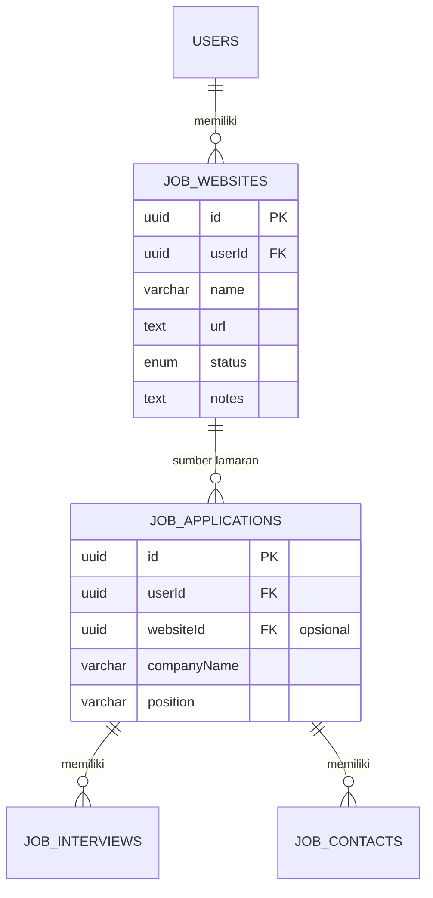

# PLANNING — Tracking Job Website

> Perencanaan fitur baru untuk modul **Job Tracker**: melacak website/sumber lamaran kerja
> (LinkedIn, Jobstreet, Glints, Kalibrr, dll) beserta statistik & status penggunaannya.

---

## 1. Tujuan

- Mengetahui dari website mana saja kita melamar kerja.
- Melacak jumlah lamaran per website + status terakhir.
- Menandai website yang masih aktif dipakai vs yang sudah tidak.
- Menyimpan catatan (misal: akun, email yang dipakai, tips khusus website).

---

## 2. Desain Tabel Database

### 2.1 Tabel baru: `job_websites`

Mengikuti konvensi schema yang sudah ada (`backend/src/db/schema.ts`):

| Kolom | Tipe | Keterangan |
| ----- | ---- | ---------- |
| `id` | `uuid` PK defaultRandom | Primary key |
| `userId` | `uuid` FK → `users.id` (cascade) | Pemilik data |
| `name` | `varchar(255)` notNull | Nama website (LinkedIn, Jobstreet, ...) |
| `url` | `text` | URL utama website |
| `status` | enum `website_status` | `active` / `inactive` / `archived` |
| `notes` | `text` | Catatan (akun, email, tips) |
| `createdAt` | `timestamp` defaultNow | Waktu dibuat |
| `updatedAt` | `timestamp` defaultNow | Waktu diupdate |

### 2.2 Enum baru

```ts
export const websiteStatusEnum = pgEnum("website_status", ["active", "inactive", "archived"]);
```

### 2.3 Drizzle schema (usulan)

```ts
export const jobWebsites = pgTable("job_websites", {
    id: uuid("id").primaryKey().defaultRandom(),
    userId: uuid("user_id").references(() => users.id, { onDelete: "cascade" }).notNull(),
    name: varchar("name", { length: 255 }).notNull(),
    url: text("url"),
    status: websiteStatusEnum("status").default("active"),
    notes: text("notes"),
    createdAt: timestamp("created_at", { withTimezone: true }).defaultNow(),
    updatedAt: timestamp("updated_at", { withTimezone: true }).defaultNow(),
});
```

### 2.4 Relasi



> **Catatan relasi:** tambahkan kolom opsional `websiteId` (FK → `job_websites.id`) di tabel
> `job_applications` agar setiap lamaran bisa dihubungkan ke website sumbernya.

---

## 3. Contoh Tabel Markdown (Tracking)

Tabel di bawah bisa dipakai sebagai referensi isi data / tampilan UI:

| Website | URL | Status | Total Lamaran | Terakhir Apply | Catatan |
| ------- | --- | ------ | ------------- | -------------- | ------- |
| LinkedIn | <https://www.linkedin.com/jobs> | 🟢 Active | 12 | 2026-08-15 | Pakai email utama |
| Jobstreet | <https://www.jobstreet.co.id> | 🟢 Active | 5 | 2026-08-10 | Update CV tiap bulan |
| Glints | <https://glints.com/id> | 🟡 Inactive | 2 | 2026-07-20 | Jarang ada role senior |
| Kalibrr | <https://www.kalibrr.com> | 🔴 Archived | 0 | - | Sudah tidak dipakai |
| Tech in Asia | <https://www.techinasia.com/jobs> | 🟢 Active | 3 | 2026-08-12 | Bagus untuk startup |

---

## 4. API Endpoints (usulan)

| Method | Endpoint | Deskripsi |
| ------ | -------- | --------- |
| GET | `/api/jobs/websites` | List semua website (dengan statistik lamaran) |
| POST | `/api/jobs/websites` | Tambah website |
| PUT | `/api/jobs/websites/:id` | Update website |
| DELETE | `/api/jobs/websites/:id` | Hapus website |

> ⚠️ **Keamanan:** semua endpoint harus filter `userId` (hindari IDOR) —
> `and(eq(jobWebsites.id, id), eq(jobWebsites.userId, user.userId))`.

---

## 5. Langkah Implementasi

- [ ] 1. Tambah enum `website_status` + tabel `job_websites` di `backend/src/db/schema.ts`
- [ ] 2. Tambah kolom `websiteId` di tabel `job_applications`
- [ ] 3. Generate & jalankan migrasi Drizzle (`npm run db:migrate`)
- [ ] 4. Buat route `/api/jobs/websites` (CRUD + filter userId)
- [ ] 5. Buat model `JobWebsite` di `mobile/lib/domain/models/`
- [ ] 6. Buat screen list + form di `mobile/lib/presentation/modules/jobs/`
- [ ] 7. Wire navigasi dari `jobs_screen.dart` (tab / menu "Websites")
- [ ] 8. Tambahkan dropdown pilih website di form lamaran (`job_form_screen.dart`)
- [ ] 9. Update `database/schema.sql` agar sinkron
- [ ] 10. Update README (daftar endpoint & modul)

---

## 6. Catatan

- Statistik "Total Lamaran" & "Terakhir Apply" bisa dihitung via `COUNT`/`MAX` dari
  `job_applications` yang punya `websiteId` — tidak perlu kolom denormalisasi.
- Status warna di UI: 🟢 Active / 🟡 Inactive / 🔴 Archived.
